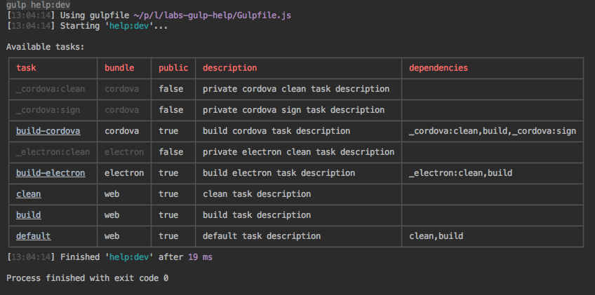

# labs-gulp-help
An example for Gulp task definitions with help task for provisioning of available tasks.

```shell
# Install dependencies
$ npm i

# Show public Gulp tasks
$ gulp help

# Show all available Gulp tasks
$ gulp help:dev
```


